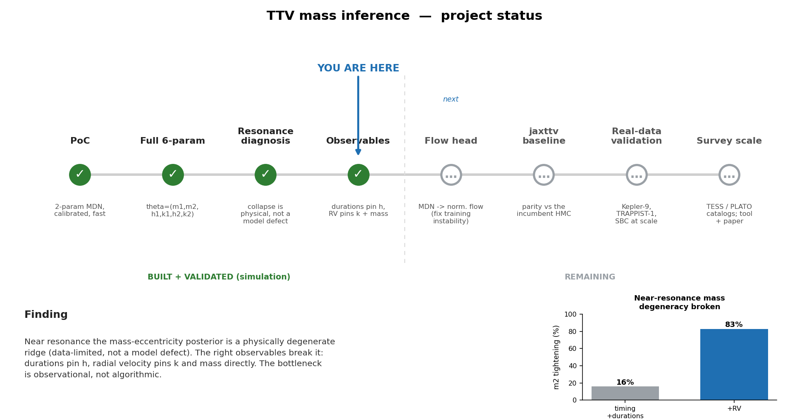
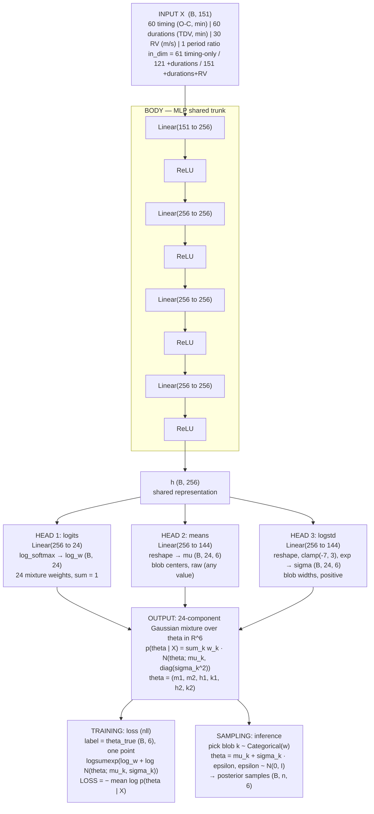

# TTV-experiment — Amortized, calibrated posterior inference for transit-timing variations

**Goal:** learn a neural network that, given the transit times of a multi-planet
system, instantly returns the *posterior distribution* over the planets' masses and
orbits — with **trustworthy uncertainties**, and **without excluding the chaotic /
near-resonant systems** where current methods give up.

**Can we do this with machine learning?** — **Yes.** This repo contains a small but
*complete, working* proof-of-concept that already demonstrates the three things that
matter: it recovers the correct posterior, the uncertainties are calibrated, and
inference is ~10⁴–10⁵× faster than the brute-force search. Everything below is real
code you can run; the numbers quoted are from an actual run.

**Where we stand** (built + validated in simulation through the observables program;
flow head, baseline parity, and real-data validation remain):



*Generated by `status_figure.py`.*

---

## 1. The problem, precisely

Transit times of a planet in a multi-planet system are not perfectly periodic — the
planets gravitationally tug each other, shifting transits by seconds to minutes
(**Transit Timing Variations, TTVs**). The *shape* of that timing signal encodes the
planets' **masses and orbital elements**, including planets that never transit.

The physics runs forward easily:

```
  theta = (masses, eccentricities, periods, phases)  --N-body simulation-->  transit times
```

But science needs the **inverse with uncertainty** — the posterior `p(theta | data)`:

```
  transit times  -->  p(masses, eccentricities, ... | data)      <-- what we want
```

There is no formula for the inverse. The standard solution is **MCMC / nested
sampling**: guess theta, simulate, compare, repeat **10⁷–10⁹ times** — hours to days
of CPU *per system*. With TESS already delivering and **PLATO (~2026)** about to flood
us with thousands of systems, this does not scale.

## 2. The gap we target (from a verified literature scan)

Two mature but **disjoint** pillars exist, with empty space between them:

- **Fast forward models** (TTVFast, Deck et al. 2014; TTVFaster, Agol & Deck 2016)
  speed up the *simulation* — but the analytic ones **provably break down in the
  resonant / high-eccentricity regime**, exactly where the TTV signal is strongest.
- **ML-for-TTV so far** (Nbody-AI 2019; DeepTTV 2024; LSTM/PSJ 2026) are mostly
  **point/prior estimators, not calibrated posteriors**, and they **exclude the
  near-resonant systems** (the 2026 LSTM paper literally filters out 3:2/2:1/5:3
  systems and reported "a deceptively tight confidence interval around an incorrect
  solution" — an explicit calibration failure).
- The flagship ML-for-dynamics success, **SPOCK** (Tamayo et al. 2020), is a stability
  *classifier*, not a TTV posterior estimator.

> **Nobody has delivered chaos-aware, calibration-validated, amortized simulation-based
> inference for TTVs.** That is the open gap, and it is what this project builds.

## 3. What the proof-of-concept already shows

An end-to-end pipeline on a 2-planet system with the **full per-planet element
vector**: both planets transit, and we infer **θ = (m₁, m₂, h₁, k₁, h₂, k₂)** — both
masses and both *eccentricity vectors* (hᵢ,kᵢ)=(eᵢcosϖᵢ, eᵢsinϖᵢ). (Periods and phases
are held fixed because periods *are* measured directly from the transit ephemerides;
masses and eccentricities are the hard, degenerate part. Eccentricity *vectors* avoid
the ϖ angle-wrap and the e→0 singularity, and are what TTVs actually constrain.)

| Test | What it checks | Result (6-D) |
|---|---|---|
| **Recovery + degeneracy** | posterior vs truth + posterior-predictive | All 6 parameters recovered within **~1σ** (\|z\|<1); reproduces the eccentricity-vector degeneracy; **100%** of observed transits fall in the posterior-predictive envelope |
| **Calibration (coverage/SBC)** | honest error bars on **every** parameter | Across all 6: 50→**~51%**, 68→**~70%**, 90→**~90%**, 95→**~94%**; SBC rank histograms **flat** |
| **Speed (amortization)** | inference cost vs the N-body an MCMC must run | MCMC would need **25–250 min** of N-body (10⁵–10⁶ sims) vs network **0.47 ms** per full posterior |

The calibration result is the headline: it is precisely the property the prior LSTM
work lacked, and it now holds for **all six** parameters simultaneously. The network
says "the mass is X ± Y," and X ± Y is *true* X% of the time.

### Stress test: does it break near the 2:1 resonance? (`resonance_sweep*.py`)

We drove the PoC toward resonance with the architecture/recipe held fixed (genuine
off-the-shelf), moving the period ratio 2.10 → 2.005 and training a fresh model at each
distance. **Result: it did not break — it degraded gracefully.**

| Sweep | e_max | TTV amplitude reached | super-period vs baseline | instability | Calibration (calErr) |
|---|---|---|---|---|---|
| low-e | 0.12 | up to 42 min | up to 8× | 0% | **1.5–2.6%** (stays calibrated) |
| eccentric | 0.30 | up to **164 min** | up to 8× | ≤0.3% | **1.5–2.6%** (stays calibrated) |

Coverage held at ~50/90% throughout; near resonance the model simply *widened* its
posteriors honestly (m2 σ grew, RMSE grew) as the super-period outran the baseline.
Two takeaways: (a) amortized SBI is more robust to large, non-sinusoidal, near-resonant
TTVs than expected — deleting high-amplitude systems (as prior ML work did) is not
required for calibration; (b) it didn't break **because each model saw a single fixed
period ratio** — amortization never faced the rugged transition *across* the resonance.

### Cross-resonance test: one model spanning the separatrix (`cross_resonance.py`)

The decisive test: a *single* model conditioned on the measured period ratio, trained
over ratio ~ U(1.90, 2.20) — crossing circulating-below → librating → circulating-above
(the survey-realistic setting). **Result: it bends, it doesn't snap — but we found the
edge.** Three concrete degradation signals appear that were absent at fixed ratio:

1. **Unstable training** — val NLL hit its best (+3.04) at epoch 60 then *diverged*
   (+4.3 → +24.0); only early-stopping salvaged it (fixed-ratio runs converged smoothly
   to −5.9). The cross-resonance landscape is hard to optimize.
2. **Informativeness collapse** — best val NLL **+3.0 vs −5.9** at fixed ratio: far
   wider, less certain posteriors when one model must cover the whole transition.
3. **Calibration degrades at the separatrix** — calErr roughly triples toward resonance
   and coverage turns overconfident:

   | \|ratio−2.0\| | regime | calErr | cov90 |
   |---|---|---|---|
   | [0.000,0.010) | separatrix | **5.6%** | **85.5%** |
   | [0.025,0.050) | near-resonant | 3.4% | 86.4% |
   | [0.050,0.100) | circulating | 1.8% | 88.4% |

Honest caveats: 5.6% never crossed the 7% "broken" flag; instability stayed 0% (e=0.15
super-Earths near 2:1 are bounded-stable); the separatrix bins hold only 187–318 systems,
so signal #3 is ~2σ from one seed and needs more near-resonance samples + multiple seeds
to firm up. Signals #1–#2 are unambiguous.

### Strong-chaos escalation (`cross_resonance_chaos.py`) + overall conclusion

We then pushed to giant, eccentric planets (Neptune→Jupiter masses, e≤0.35) spanning the
resonance, with the simulator now flagging ejections. **No catastrophic calibration
break appeared, and two hypotheses were falsified:**

- **The 2:1 resonance is *protective*.** Instability stayed low (1.8%) and was *lower*
  near resonance (0% at the separatrix vs 2.7% in the outer bin) — first-order MMRs
  shield against ejection, the opposite of "instability spikes at the separatrix."
- **Calibration held** (global calErr 3.4%, cov90 88.3%); only the same modest, noisy
  separatrix elevation (~6%, under the 7% flag).

**The reproducible failure mode, monotonic across all five experiments, is trainability
and informativeness — not miscalibration:**

| regime | best val NLL | training |
|---|---|---|
| fixed ratio (PoC) | **−5.9** (tight/informative) | smooth |
| cross-resonance, mild (e≤0.15) | **+3.0** | diverges after ep.60 |
| cross-resonance, giants (e≤0.35) | **+5.7** | diverges after ep.30 → +44 |

The off-the-shelf model breaks in **information, not honesty**: across the resonance it
stays calibrated only by *ballooning posteriors toward the prior* (an ~11-nat NLL
collapse) and its training destabilizes (usable only via early-stopping).

### Physical-vs-model disambiguation (`disambiguation.py`)

Is the near-resonance informativeness collapse **physical** (data under-constrains θ →
lever is more data) or a **model limitation** (MDN over-widens → lever is a flow)? We
built an independent ABC reference posterior (large prior pool simulated at the system's
known ratio; keep the K closest TTV matches) and compared REFERENCE vs MDN marginal
widths as a fraction of the prior width.

**Verdict: mostly PHYSICAL.** The MDN's widths track the ABC reference at both a
near-resonance and a control ratio, and are *never wider* than it — the "MDN over-widens"
case never triggered. Combined with the (independent) calibration evidence that the MDN
is not under-confident, the wide near-resonance posteriors reflect genuinely data-limited
information, not a deficient estimator. A fancier density estimator will not sharpen them.

Caveats kept honest: the ABC pool was sparsity-limited (best χ²≈164 vs noise floor ~60,
so ABC is an *upper bound* on true width — the verdict leans on the calibration argument);
the test compares *widths*, so it is blind to *multimodality*; and the MDN's training
instability is a separate real defect.

### Refined project thesis (what the five experiments + disambiguation establish)

1. Amortized SBI for TTV is **calibration-robust out of the box** — even at huge
   near-resonant amplitudes, giant eccentric planets, and across the separatrix.
2. It does not fail by overconfidence; it fails by **unstable training** and an
   **informativeness collapse** as it spans the resonance — and that collapse is largely
   **physical (data-limited)**, not a model defect.
3. Therefore the bottleneck for posterior *sharpness* near resonance is **observational,
   not algorithmic**. The genuine ML contributions are: **(a)** amortization at PLATO
   scale; **(b)** a normalizing flow for *faithful multimodal* posteriors + *stable
   training* (not for tighter marginals); **(c)** ingesting **more observables**
   (transit durations, RVs) — the real lever for information.

The original "chaos-aware emulation" framing is thus replaced by a sharper, evidence-based
one: **stable, faithful, amortized SBI that jointly exploits all observables, validated by
calibration at survey scale** — with realistic expectations about where information
actually comes from.

### Run it yourself
```bash
pip install numpy torch rebound
python ttv_demo.py     # conceptual demo: one system's TTV signal + the degeneracy valley
python train.py        # generate ~17k N-body sims, train the 6-D MDN posterior estimator (~5 min)
python evaluate.py     # the three validation tests above
```

### Files
- `simulator.py` — **REBOUND (WHFast symplectic) N-body**, full element vector, both planets transit
- `model.py` — Mixture Density Network = amortized neural posterior estimator
- `train.py` — simulate → train; `evaluate.py` — recovery, calibration, speed
- `ttv_demo.py` — the standalone conceptual demonstration (uses its own self-contained integrator)

### What the PoC deliberately simplifies (and the project fixes)
- **REBOUND/WHFast + full 6-param element vector already in place**; remaining forward-model
  work is **TTVFast cross-checks** for cheap regions and **reboundx** extra forces (GR, tides).
- **Fixed 2 planets** → variable planet count (3+), via a set/sequence encoder.
- **MDN / diagonal Gaussians** → **normalizing-flow posterior** (`sbi`), which represents
  arbitrarily curved/multimodal posteriors (the 6-D run already shows mild bimodality the MDN
  only approximates).
- **Avoids true resonance** → the project's core contribution is to *retain* it.

## 4. The data: what, and where to get it

This is **simulation-based inference** — training data is *generated*, not downloaded.
That is a feature: we can make unlimited, perfectly-labeled examples.

**Training data (simulated).** Sample `theta` from astrophysical priors → run the N-body
forward model → record transit times → add realistic observational noise. The labels
are exact (we know the input theta). Generate millions, weighted to **oversample the
resonant/chaotic regime** the network must master.

**Priors and system architectures** come from real catalogs:
- **NASA Exoplanet Archive** (Kepler/K2/TESS confirmed + candidate multis) — period
  ratios, radii, multiplicities to make priors realistic.
- **Kepler TTV catalogs** (Holczer et al. 2016; Rowe et al.) — measured transit times
  and noise levels to calibrate the noise model and feature design.
- **Hadden & Lithwick (2017)** mass–eccentricity catalog — a sanity check for recovered
  posteriors on real systems.

**Real test data (for validation on the sky).** Apply the trained network to measured
transit times of benchmark systems with independent mass measurements:
- **Kepler-9**, **TRAPPIST-1**, **Kepler-11**, **TOI-216** — systems with published
  N-body/MCMC TTV posteriors → compare our amortized posterior against the gold standard.
- **TESS** SPOC/QLP transit times; **PLATO** once it flies.

**Software for the forward model:** `REBOUND`+`WHFast` (and `TTVFast`) for ground-truth
N-body; `reboundx` for GR/tidal forces if needed.

## 5. The model

**Approach: amortized neural posterior estimation (NPE), the modern form of
simulation-based inference.** Train a conditional density estimator `q(theta | x)` on
(theta, simulated-data) pairs; after a one-time training cost, inference on any new
system is a single forward pass.

- **PoC model:** Mixture Density Network (a mixture-of-Gaussians head) — already enough
  to capture the curved degeneracy and produce calibrated intervals.
- **Production model:** **normalizing-flow** posterior (e.g. neural spline flow via the
  `sbi` toolkit, SNPE-C). Flows represent arbitrarily shaped, multimodal posteriors —
  essential once the resonant regime fractures the posterior.
- **Input/encoder:** the transit-time series is irregular and variable-length. Use a
  **set/sequence encoder** (transformer or deep-set over per-transit (epoch, time,
  uncertainty) tuples) so the model ingests heterogeneous real data and handles
  different planet counts.
- **Chaos-aware design (the novel core):** in chaotic regions a single transit-time
  vector is not a deterministic function of theta. Treat the simulator as *stochastic*
  and have the network predict a posterior that reflects that intrinsic spread — and/or
  predict robust **summary statistics** (TTV amplitude, super-period, chopping) rather
  than raw times. Borrow **SPOCK-style features** as inputs and as a stability prefilter.

### PoC architecture in detail (`model.py`)

The current MDN is a shared MLP trunk feeding three output heads that together parametrize
a 24-component Gaussian mixture over the 6-D parameter vector `θ = (m1, m2, h1, k1, h2, k2)`.
The example below uses the full timing + durations + RV arm (`in_dim = 151`); `in_dim` is
61 (timing-only), 121 (+durations), or 151 (+durations+RV), always with the period ratio
appended as the trailing conditioning input. `B` = batch size, `K = n_comp = 24`.

```
════════════════════════════════════════════════════════════════════════════════
   MDN  —  Amortized Neural Posterior Estimator  (model.py)
   Concrete example: timing + durations + RV arm.  B = batch size
════════════════════════════════════════════════════════════════════════════════

INPUT  X                      the observed data vector, one per system
┌──────────────────────────────────────────────────────────────────┐
│  60 timing (O-C, min) │ 60 durations (TDV, min) │ 30 RV (m/s) │ 1 │   shape (B, 151)
└──────────────────────────────────────────────────────────────────┘
        └── the trailing "1" is the appended period ratio (conditioning input)
        (in_dim = 61 timing-only  |  121 +durations  |  151 +durations+RV)
                              │
                              ▼
┌──────────────────────── BODY  (MLP, shared trunk) ───────────────────────┐
│                                                                          │
│   Linear(151 → 256)   ──►  ReLU                          (B, 256)        │
│   Linear(256 → 256)   ──►  ReLU                          (B, 256)        │
│   Linear(256 → 256)   ──►  ReLU                          (B, 256)        │
│   Linear(256 → 256)   ──►  ReLU                          (B, 256)        │
│                                                                          │
│   ReLU(z) = max(0, z)   — the nonlinearity; without it the 4 Linear      │
│   layers would collapse into one. Turns X into a 256-d feature h.        │
└──────────────────────────────────────────────────────────────────────────┘
                              │
                        h  (B, 256)          shared representation
                              │
          ┌───────────────────┼───────────────────┐
          ▼                   ▼                   ▼
┌──────────────────┐ ┌──────────────────┐ ┌──────────────────────┐
│  HEAD 1: logits  │ │  HEAD 2: means   │ │  HEAD 3: logstd      │
│  Linear(256→24)  │ │ Linear(256→144)  │ │  Linear(256→144)     │
│                  │ │   =24×6          │ │    =24×6             │
│  (B, 24)         │ │  (B, 144)        │ │   (B, 144)           │
│      │           │ │      │           │ │       │              │
│  log_softmax     │ │  reshape         │ │  reshape             │
│   (dim = -1)     │ │  →(B,24,6)       │ │  →(B,24,6)           │
│      │           │ │      │           │ │       │              │
│      ▼           │ │      ▼           │ │  clamp(-7, 3)        │
│  log_w           │ │  mu              │ │       │              │
│  (B, 24)         │ │  (B, 24, 6)      │ │       ▼              │
│                  │ │                  │ │  log_sigma           │
│  24 mixture      │ │  center of each  │ │  (B, 24, 6)          │
│  weights,        │ │  of 24 blobs,    │ │  σ = exp(log_sigma)  │
│  Σ = 1           │ │  each a 6-D pt   │ │  width of each blob  │
└──────────────────┘ └──────────────────┘ └──────────────────────┘
   (probabilities)      (any real value)      (positive, via exp)
          │                   │                   │
          └───────────────────┼───────────────────┘
                              ▼
        ╔═══════════════════════════════════════════════════════╗
        ║   OUTPUT:  24-component Gaussian mixture over θ ∈ ℝ⁶   ║
        ║                                                       ║
        ║   p(θ | X) = Σ  w_k · N( θ ; mu_k , diag(σ_k²) )      ║
        ║             k=1..24                                   ║
        ║                                                       ║
        ║   θ = (m1, m2, h1, k1, h2, k2)   ← the 6 unknowns     ║
        ╚═══════════════════════════════════════════════════════╝
                              │
             ┌────────────────┴─────────────────┐
             ▼                                  ▼
   TRAINING: loss (nll)                SAMPLING (inference)
┌───────────────────────────────┐   ┌───────────────────────────────┐
│ label = θ_true  (B, 6)        │   │ pick blob k ~ Categorical(w)  │
│ one point, NOT a distribution │   │ draw θ = mu_k + σ_k · ε        │
│                               │   │   ε ~ N(0, I)                  │
│ per component:                │   │ → posterior samples (B, n, 6)  │
│  log N(θ; mu_k, σ_k)          │   │ (the point cloud in the        │
│ combine over 24 comps:        │   │  m2–k2 overlay figure)         │
│  logsumexp(log_w + log_comp)  │   └───────────────────────────────┘
│ = log p(θ_true | X)           │
│                               │
│  LOSS = − mean log p(θ|X)     │  ← negative log-likelihood
│  "make the blob dense at      │     minimized by Adam + grad clip
│   the true θ"                 │
└───────────────────────────────┘

────────────────────────────────────────────────────────────────────────────────
 Hyperparameters (model.py):  hidden = 256,  n_comp (K) = 24,  theta_dim = 6
 Activations:  ReLU (body) · log_softmax (weights) · exp after clamp (widths)
 Heads left raw:  means (centers can be any value)
────────────────────────────────────────────────────────────────────────────────
```

The same architecture as a Mermaid flowchart (renders natively on GitHub):



**Validation is part of the model, not an afterthought:** simulation-based calibration
(SBC) + coverage tests on every release, plus head-to-head against N-body MCMC on the
benchmark systems above.

## 6. Roadmap

| Phase | Deliverable | Status |
|---|---|---|
| **0. PoC** | 2-planet, 2-param, MDN, calibrated, fast, **REBOUND N-body** | ✅ **done** |
| **1. Full element vector** | ✅ REBOUND/WHFast + **6-param θ=(m₁,m₂,h₁,k₁,h₂,k₂)**, both planets transit, calibrated across all 6 | ✅ **done (this repo)** |
| 2. Flow + encoder | `sbi` normalizing-flow posterior + set/transformer encoder; variable planet count; TTVFast cross-checks | next |
| 3. Resonant regime | oversample + explicitly model chaotic systems; stochastic-simulator treatment | core novelty |
| 4. Real-data validation | run on Kepler-9 / TRAPPIST-1 etc.; match published MCMC posteriors; SBC at scale | |
| 5. Survey scale | batch-apply to TESS/PLATO catalogs; release tool + paper | |

## 7. Honest caveats
- The PoC's speed-up is measured against a *coarse* 572-sim grid; a fair comparison to a
  full MCMC posterior (10⁵–10⁷ sims) would show a far larger amortized gain, but should
  be benchmarked properly in Phase 4.
- "No calibration-validated SBI-for-TTV exists" reflects the surveyed literature
  (2014–2026); **before committing, run a targeted arXiv `astro-ph.EP` check** for any
  very recent `sbi`/normalizing-flow-on-TTV preprint that could overlap.
- Whether a deterministic surrogate is even well-posed *inside* the chaotic regime is an
  open scientific question — Phase 3 is genuine research, not just engineering.

---

### Key references
Agol & Fabrycky 2018 (TTV review, arXiv:1706.09849) · Deck et al. 2014 (TTVFast,
arXiv:1403.1895) · Agol & Deck 2016 (TTVFaster, arXiv:1509.01623) · Lithwick, Xie & Wu
2012 · Hadden & Lithwick 2017 · Pearson 2019 (Nbody-AI, AJ 158,243) · DeepTTV 2024
(arXiv:2409.04557) · LSTM/PSJ 2026 (10.3847/PSJ/ae3e86) · Tamayo et al. 2020 (SPOCK,
PNAS) · Cranmer, Brehmer & Louppe 2020 (SBI review, arXiv:1911.01429) · Talts et al.
2018 (SBC, arXiv:1804.06788) · Tejero-Cantero et al. 2020 (`sbi`, JOSS).
